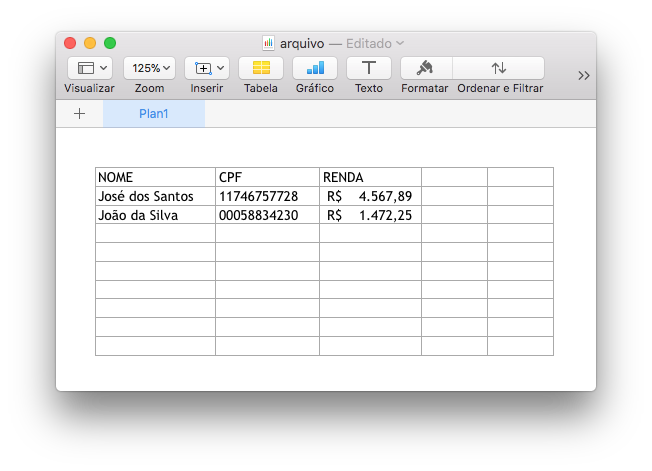

## easy-poi

Criei este projeto para mostrar uma forma fácil de trabalhar com a biblioteca Apache POI na leitura e escrita de arquivos xls e xlsx.

A ideia é exportar DTOs para arquivos Excel, e vice-versa.

Também simplifiquei a API para estes casos de uso, criando correspondentes para as classes do POI: 

Apache POI | easy-poi
------------ | -------------
Workbook | PastaTrabalho
Sheet | Planilha
Row | Linha
Cell | Celula

Podemos trabalhar com as classes do easy-poi diretamente **ou** usar uma abstração maior, como é demonstrado nas classes do pacote `demo`. 

## Exemplos

No pacote `demo` criei dois exemplos de uso com DTOs.   

### DTO &rarr; Excel

A exportação trabalha com uma lista de objetos cujos atributos são anotados com `@ExcelColumn`. A ordem dos atributos na classe define a ordem das colunas no arquivo Excel. O valor passado para a anotação define o nome da coluna. 

```
List<TesteDTO> objetosExportar = newArrayList(
    TesteDTO.of("José", BigDecimal.ONE),
    TesteDTO.of("João", BigDecimal.TEN)
);

File arquivo = new ExportacaoExcelService<>(ExportacaoDTO.class)
    .exportar(objetosExportar);
```

O retorno será um `File`, com nome aleatório (`UUID.randomUUID()`) e extensão xlsx. A planilha gerada será parecida com esta:



### Excel &rarr; DTO

A importação lê um arquivo Excel com seguinte estrutura:

* Cabeçalho
* Valores


O mapeamento entre as colunas do Excel e o DTO é feito pela anotação `@ExcelColumn` nos atributos do DTO.

**Obs.:** o tipo dos atributos deve ser `String`. No getter podemos implementar a conversão para o tipo correto.

```
ArquivoDTO file = getArquivoExcel();
List<TesteDTO> dtos = new ImportacaoExcelService<>(TesteDTO.class).importar(file);
```

### Diminuindo a abstração

Se quiser, é possível trabalhar diretamente com as clases do easy-poi. Exemplo:

```
PastaTrabalho pastaTrabalho = PastaTrabalho.nova();
Planilha planilha = pastaTrabalho.planilhaPrincipal();
planilha.novaLinha()
        .preencherCom(Lists.newArrayList("Nome", "Sobrenome"));
planilha.novaLinha()
        .preencherCom(Lists.newArrayList("José", "Silva"));
planilha.novaLinha()
        .preencherCom(Lists.newArrayList("João", "Costa"));
File arquivo = pastaTrabalho.exportar();
```
